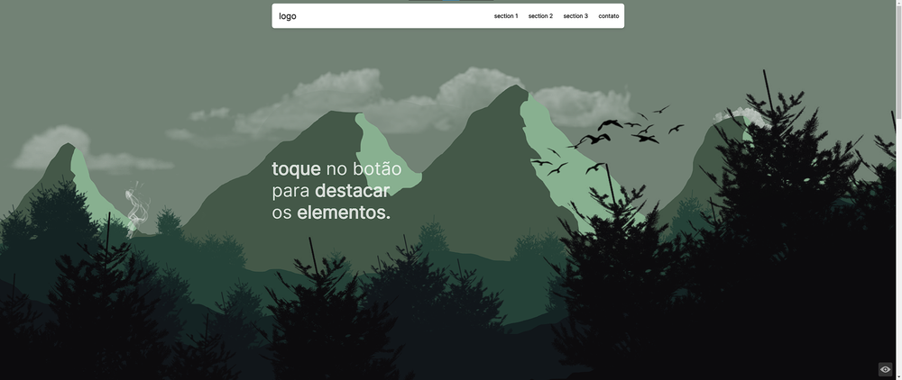
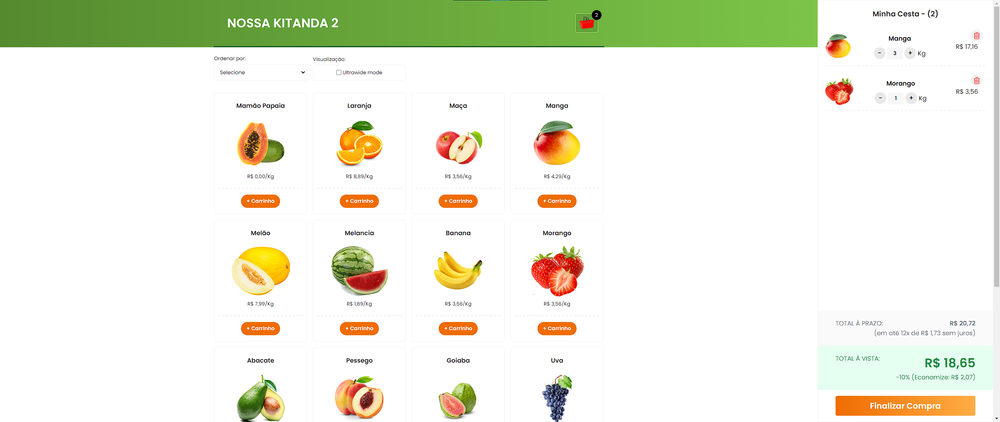

<h3 align=center>

__Live Demo__

</h3>

<a href="https://hugojhonathan.github.io/projetos-de-treino/1.one-page-flexbox-responsive-scss-">
1.one-page-flexbox-responsive-scss-
</a>

  

<a href="https://hugojhonathan.github.io/projetos-de-treino/2.nossa-kitanda-v2-[js-class-components]">
2.nossa-kitanda-v2-[js-class-components]
</a>

  
