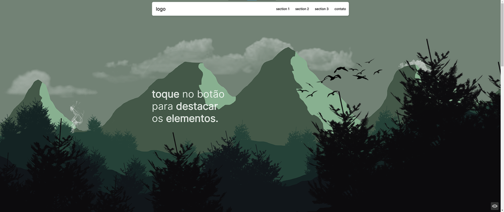
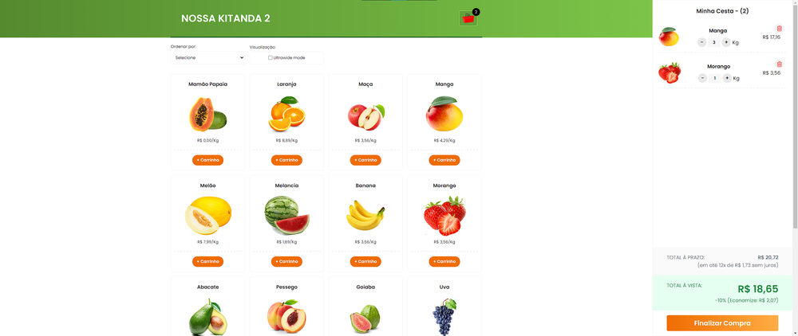

<h2 align=center>

__Live Demo__

</h2>

    <a href="https://hugojhonathan.github.io/projetos-de-treino/one-page-flexbox-responsive-scss-/">
    one-page-flexbox-responsive-scss-
    </a>
    
[

](https://hugojhonathan.github.io/projetos-de-treino/one-page-flexbox-responsive-scss-/)

  

    <a href="https://hugojhonathan.github.io/projetos-de-treino/nossa-kitanda-v2-[js-class-components]">
    nossa-kitanda-v2-[js-class-components]
    </a>

[

](https://hugojhonathan.github.io/projetos-de-treino/nossa-kitanda-v2-[js-class-components])

  